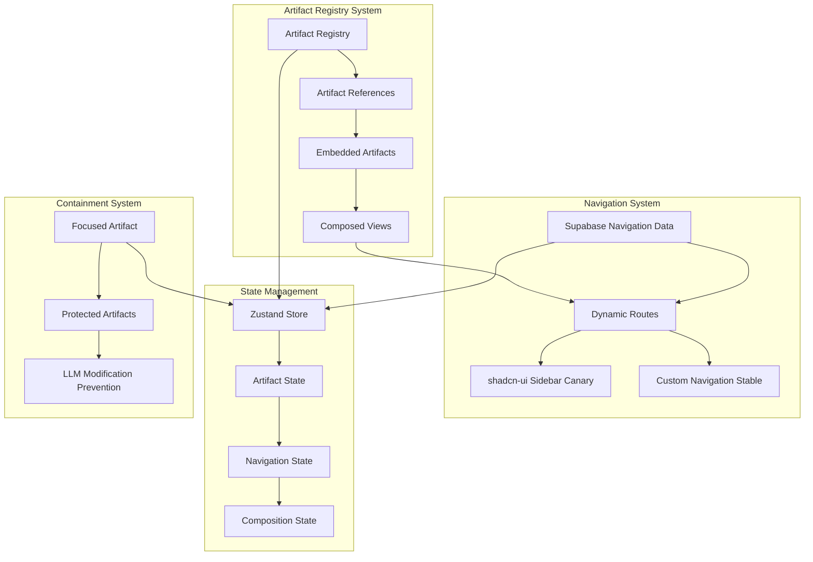

# Comprehensive Supabase Artifact Registry System Plan

## Vision
Build a sophisticated artifact registry system where:
- **Artifacts are reusable components** that can reference and embed other artifacts
- **Navigation is data-driven** from Supabase (dynamic menus, routes)
- **shadcn-ui canary/stable support** with proper navigation controls
- **Zustand state management** for architectural soundness
- **Containment system** prevents LLM from modifying non-focused artifacts
- **Registry-based composition** similar to shadcn/ui distribution

## Current Problems to Solve
1. **Architectural Confusion**: Two conflicting systems (simple configs vs complex tool registry)
2. **Missing Registry System**: No artifact-to-artifact referencing capability
3. **No Navigation Integration**: Supabase data not connected to navigation
4. **shadcn-ui Version Support**: Need both canary (with sidebar) and stable builds
5. **State Management**: No Zustand integration for artifact composition
6. **Containment Issues**: LLM can modify any artifact, breaking design sessions

## Architecture Overview



## Implementation Strategy

### Phase 1: Foundation & Cleanup
**Goal**: Clean up existing mess and establish solid foundation

1. **Consolidate Supabase Systems**
   - Remove over-engineered tool registry (keep simple artifact configs)
   - Fix duplicate schemas and dependency issues
   - Create unified Supabase configuration system

2. **Establish Artifact Registry**
   - Create artifact metadata storage (MongoDB)
   - Define artifact reference/dependency system
   - Build artifact resolution and loading system

3. **Zustand Store Architecture**
   - Design store structure for artifact composition
   - Implement navigation state management
   - Add containment/focus state tracking

### Phase 2: Navigation & shadcn-ui Integration
**Goal**: Dynamic navigation from Supabase data with proper UI framework support

1. **shadcn-ui Version Detection & Support**
   - Detect canary vs stable builds in artifacts
   - Provide sidebar components for canary builds
   - Create custom navigation for stable builds
   - Ensure consistent API across both versions

2. **Dynamic Navigation System**
   - Supabase schema for navigation items
   - Navigation data fetching and caching
   - Route generation from database
   - Integration with artifact routing

3. **Navigation Components**
   - Sidebar component (canary builds)
   - Custom navigation component (stable builds)
   - Navigation item rendering from Supabase
   - Route protection and permissions

### Phase 3: Artifact Composition & Registry
**Goal**: Enable artifacts to reference and embed other artifacts

1. **Artifact Registry System**
   - Artifact metadata and versioning
   - Dependency resolution system
   - Circular dependency prevention
   - Artifact loading and caching

2. **Artifact Composition**
   - Embed artifact syntax: `<ArtifactEmbed id="artifact-123" />`
   - Props passing between artifacts
   - State isolation and communication
   - Error boundaries for embedded artifacts

3. **Registry API**
   - Artifact discovery and search
   - Version management
   - Dependency tracking
   - Usage analytics

### Phase 4: Containment & LLM Protection
**Goal**: Prevent LLM from modifying non-focused artifacts

1. **Containment System**
   - Artifact focus tracking
   - Modification permission system
   - Protected artifact rendering
   - LLM instruction injection

2. **Design Session Management**
   - Multi-artifact project tracking
   - Focus switching between artifacts
   - Change isolation and rollback
   - Collaborative editing protection

### Phase 5: Advanced Features
**Goal**: Polish and advanced functionality

1. **Advanced Composition**
   - Artifact templates and scaffolding
   - Component library integration
   - Theme and styling inheritance
   - Performance optimization

2. **Developer Experience**
   - Artifact development tools
   - Registry CLI commands
   - Documentation generation
   - Testing framework integration

## Technical Implementation Details

### Zustand Store Structure
```typescript
interface ArtifactStore {
  // Registry
  artifacts: Record<string, ArtifactMetadata>
  dependencies: Record<string, string[]>
  
  // Navigation
  navigationItems: NavigationItem[]
  currentRoute: string
  sidebarOpen: boolean
  
  // Composition
  focusedArtifact: string | null
  embeddedArtifacts: Record<string, EmbeddedArtifact>
  
  // Containment
  protectedArtifacts: Set<string>
  modificationPermissions: Record<string, boolean>
}
```

### Artifact Metadata Schema
```typescript
interface ArtifactMetadata {
  id: string
  name: string
  version: string
  description: string
  dependencies: string[]
  exports: ComponentExport[]
  supabaseConfig?: SupabaseConfig
  shadcnVersion: 'canary' | 'stable'
  navigationItems?: NavigationItem[]
}
```

### Navigation Schema (Supabase)
```sql
CREATE TABLE navigation_items (
  id UUID PRIMARY KEY,
  artifact_id UUID REFERENCES artifacts(id),
  label TEXT NOT NULL,
  path TEXT NOT NULL,
  icon TEXT,
  parent_id UUID REFERENCES navigation_items(id),
  order_index INTEGER,
  permissions JSONB,
  created_at TIMESTAMP DEFAULT NOW()
);
```

## Implementation Tasks

### Foundation Tasks
- [ ] Remove over-engineered supabase tools controller/routes/middleware
- [ ] Consolidate duplicate schemas into single source of truth
- [ ] Fix dependency import issues in packages
- [ ] Create unified Supabase configuration system
- [ ] Design and implement Zustand store architecture
- [ ] Create artifact metadata storage schema

### Navigation System Tasks
- [ ] Implement shadcn-ui version detection in artifacts
- [ ] Create sidebar component for canary builds
- [ ] Create custom navigation component for stable builds
- [ ] Design Supabase schema for navigation items
- [ ] Implement dynamic route generation from database
- [ ] Build navigation data fetching and caching system

### Registry System Tasks
- [ ] Create artifact registry API endpoints
- [ ] Implement artifact dependency resolution
- [ ] Build artifact loading and caching system
- [ ] Create artifact embedding syntax and components
- [ ] Implement state isolation between artifacts
- [ ] Add error boundaries for embedded artifacts

### Containment System Tasks
- [ ] Implement artifact focus tracking system
- [ ] Create modification permission system
- [ ] Build protected artifact rendering
- [ ] Add LLM instruction injection for containment
- [ ] Implement design session management
- [ ] Create change isolation and rollback system

### Integration Tasks
- [ ] Update ArtifactPreview to support registry system
- [ ] Modify Sandpack integration for artifact composition
- [ ] Connect SupabaseSettings to unified configuration
- [ ] Implement real Supabase connection testing
- [ ] Add proper error handling throughout system
- [ ] Create comprehensive testing suite

## Success Criteria

### Core Functionality
- ✅ Artifacts can embed other artifacts using registry system
- ✅ Navigation items are dynamically loaded from Supabase
- ✅ Both shadcn-ui canary and stable builds are supported
- ✅ Zustand store manages all artifact and navigation state
- ✅ LLM can only modify the focused artifact
- ✅ Complex views can be composed from multiple artifacts

### Technical Quality
- ✅ Clean, maintainable codebase following LibreChat patterns
- ✅ No duplicate schemas or conflicting systems
- ✅ Docker builds work without dependency issues
- ✅ Real connection testing validates Supabase connectivity
- ✅ Proper error handling and user feedback
- ✅ Performance optimized for complex compositions

### User Experience
- ✅ Seamless artifact composition and embedding
- ✅ Intuitive navigation that adapts to data
- ✅ Protected design sessions prevent accidental modifications
- ✅ Consistent UI across shadcn-ui versions
- ✅ Fast loading and responsive interactions
- ✅ Clear error messages and recovery options

## Migration Strategy

1. **Preserve Working Parts**: Keep SupabaseSettings.tsx and TSupabaseConfig
2. **Gradual Replacement**: Replace complex systems piece by piece
3. **Backward Compatibility**: Ensure existing artifacts continue working
4. **Feature Flags**: Use flags to enable new features incrementally
5. **Testing**: Comprehensive testing at each migration step
6. **Documentation**: Update docs as features are migrated

This plan transforms the fragmented Supabase tools implementation into a sophisticated, production-ready artifact registry and composition system that enables powerful, data-driven applications while maintaining clean architecture and preventing LLM interference.