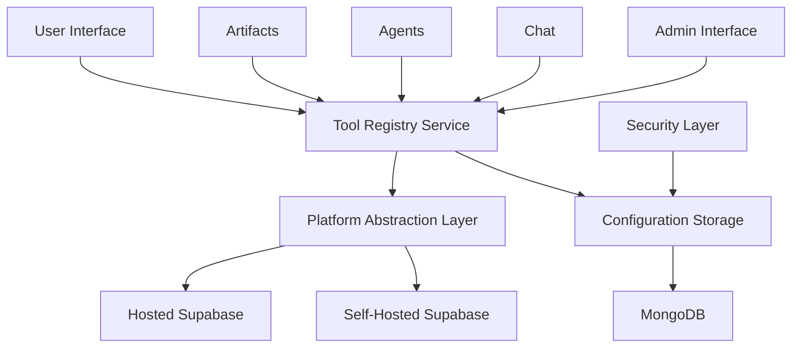

# LibreChat Supabase Tool System

## Overview

The LibreChat Supabase Tool System is an internal tool management system that provides centralized configuration and access to multiple Supabase instances (both hosted and self-hosted). This system is inspired by the Supabase MCP server architecture but designed specifically for LibreChat's internal use.

## Architecture

### Core Components



### Key Features

1. **Multiple Named Configurations**: Support unlimited Supabase instances with unique names
2. **Dual Deployment Support**: Both Supabase Cloud and self-hosted instances
3. **Feature-Based Access**: Configurable feature sets per tool (database, storage, auth, functions, realtime)
4. **Flexible Integration**: Named tool references OR direct URL/key pairs for artifacts
5. **Security**: Encrypted credential storage and role-based access control
6. **Backward Compatibility**: Existing artifact configurations continue to work

## Data Models

### SupabaseTool Schema

```typescript
interface SupabaseTool {
  id: string;
  name: string;                    // Unique tool name
  description?: string;
  type: 'hosted' | 'self-hosted';
  config: HostedConfig | SelfHostedConfig;
  features: FeatureGroup[];        // Enabled feature sets
  userId?: string;                 // null for system-wide tools
  createdAt: Date;
  updatedAt: Date;
  isActive: boolean;
  healthStatus?: 'healthy' | 'unhealthy' | 'unknown';
  lastHealthCheck?: Date;
}

interface HostedConfig {
  projectRef: string;              // Supabase project reference
  anonKey: string;                 // Public anonymous key
  serviceKey?: string;             // Private service key (encrypted)
  region?: string;                 // Optional region specification
}

interface SelfHostedConfig {
  url: string;                     // Base URL of self-hosted instance
  anonKey: string;                 // Public anonymous key
  serviceKey?: string;             // Private service key (encrypted)
  apiVersion?: string;             // API version compatibility
  customHeaders?: Record<string, string>; // Additional headers
}

type FeatureGroup = 
  | 'database'    // PostgREST API access
  | 'storage'     // File storage operations
  | 'auth'        // Authentication services
  | 'functions'   // Edge functions
  | 'realtime';   // Real-time subscriptions
```

### Artifact Integration

```typescript
interface ArtifactSupabaseConfig {
  toolName?: string;               // Reference to named tool
  directConfig?: {                 // Fallback to direct config
    url: string;
    anonKey: string;
  };
}
```

## Platform Abstraction

The platform abstraction layer provides a unified interface for both hosted and self-hosted Supabase instances:

```typescript
interface SupabasePlatform {
  // Connection management
  createClient(config: SupabaseConfig): SupabaseClient;
  testConnection(config: SupabaseConfig): Promise<boolean>;
  
  // Feature detection
  getSupportedFeatures(config: SupabaseConfig): Promise<FeatureGroup[]>;
  
  // Health monitoring
  checkHealth(config: SupabaseConfig): Promise<HealthStatus>;
}
```

## Usage Examples

### 1. Tool Configuration

```typescript
// Create a new hosted Supabase tool
const hostedTool: SupabaseTool = {
  name: 'production-db',
  description: 'Production database for main app',
  type: 'hosted',
  config: {
    projectRef: 'abcdefghijklmnop',
    anonKey: 'eyJhbGciOiJIUzI1NiIsInR5cCI6IkpXVCJ9...',
    serviceKey: 'eyJhbGciOiJIUzI1NiIsInR5cCI6IkpXVCJ9...' // encrypted
  },
  features: ['database', 'storage', 'auth'],
  isActive: true
};

// Create a self-hosted tool
const selfHostedTool: SupabaseTool = {
  name: 'local-dev',
  description: 'Local development instance',
  type: 'self-hosted',
  config: {
    url: 'http://localhost:54321',
    anonKey: 'eyJhbGciOiJIUzI1NiIsInR5cCI6IkpXVCJ9...',
    apiVersion: 'v1'
  },
  features: ['database', 'storage'],
  isActive: true
};
```

### 2. Artifact Usage

```typescript
// Using named tool reference
const artifactConfig: ArtifactSupabaseConfig = {
  toolName: 'production-db'
};

// Using direct configuration (backward compatibility)
const directConfig: ArtifactSupabaseConfig = {
  directConfig: {
    url: 'https://abcdefghijklmnop.supabase.co',
    anonKey: 'eyJhbGciOiJIUzI1NiIsInR5cCI6IkpXVCJ9...'
  }
};
```

### 3. Artifact Code Usage

```javascript
// In artifact code - the createSupabase() function automatically
// resolves the configuration from the tool system
const supabase = createSupabase();

// Use the client normally
const { data, error } = await supabase
  .from('todos')
  .select('*');
```

## API Endpoints

### Tool Management

```
GET    /api/supabase-tools           # List all tools for user
POST   /api/supabase-tools           # Create new tool
GET    /api/supabase-tools/:id       # Get specific tool
PUT    /api/supabase-tools/:id       # Update tool
DELETE /api/supabase-tools/:id       # Delete tool
POST   /api/supabase-tools/:id/test  # Test tool connection
GET    /api/supabase-tools/:id/health # Check tool health
```

### System Administration

```
GET    /api/admin/supabase-tools     # List all system tools (admin only)
POST   /api/admin/supabase-tools     # Create system-wide tool (admin only)
GET    /api/admin/supabase-tools/stats # Usage statistics (admin only)
```

## Security Considerations

### Credential Protection

1. **Encryption**: Service keys are encrypted at rest using AES-256
2. **Access Control**: Role-based access to tool configurations
3. **Audit Logging**: All tool operations are logged for security auditing
4. **Connection Validation**: Regular health checks ensure tool availability

### Permission Model

- **System Tools**: Created by administrators, available to all users
- **User Tools**: Created by individual users, private to that user
- **Feature Restrictions**: Tools can be configured with limited feature access

## Migration Strategy

### Phase 1: Foundation
1. Implement core tool system infrastructure
2. Create database models and API endpoints
3. Build basic UI for tool management

### Phase 2: Integration
1. Modify artifact system to support tool references
2. Maintain backward compatibility with direct configuration
3. Update shared utilities and examples

### Phase 3: Advanced Features
1. Add health monitoring and connection validation
2. Implement audit logging and usage analytics
3. Create migration tools for existing configurations

### Phase 4: Documentation & Testing
1. Comprehensive documentation and examples
2. Unit and integration test coverage
3. Performance optimization and monitoring

## Configuration Examples

### Environment Variables

```bash
# Encryption key for sensitive data
SUPABASE_TOOL_ENCRYPTION_KEY=your-32-character-encryption-key

# Default health check interval (minutes)
SUPABASE_TOOL_HEALTH_CHECK_INTERVAL=30

# Maximum number of tools per user
SUPABASE_TOOL_MAX_PER_USER=10
```

### Tool Configuration Templates

```yaml
# Hosted Supabase Template
hosted_template:
  type: hosted
  config:
    projectRef: "${PROJECT_REF}"
    anonKey: "${ANON_KEY}"
    serviceKey: "${SERVICE_KEY}"
    region: "us-east-1"
  features:
    - database
    - storage
    - auth
    - functions
    - realtime

# Self-Hosted Template
self_hosted_template:
  type: self-hosted
  config:
    url: "${SUPABASE_URL}"
    anonKey: "${ANON_KEY}"
    serviceKey: "${SERVICE_KEY}"
    apiVersion: "v1"
  features:
    - database
    - storage
```

## Troubleshooting

### Common Issues

1. **Connection Failures**: Check network connectivity and credentials
2. **Feature Unavailable**: Verify feature is enabled in tool configuration
3. **Permission Denied**: Ensure user has access to the specified tool
4. **Health Check Failures**: Review tool configuration and Supabase instance status

### Debugging

```javascript
// Enable debug logging
window.__LIBRECHAT_DEBUG__ = true;

// Check tool resolution
console.log(window.__LIBRECHAT_SUPABASE_CONFIG__);

// Test connection manually
const supabase = createSupabase();
console.log('Supabase client:', supabase);
```

## Future Enhancements

1. **Multi-Tool Support**: Extend system to support other database tools (PostgreSQL, MySQL, etc.)
2. **Advanced Monitoring**: Real-time performance metrics and alerting
3. **Team Management**: Shared tool configurations for team collaboration
4. **Version Control**: Configuration versioning and rollback capabilities
5. **Integration Templates**: Pre-built configurations for common use cases