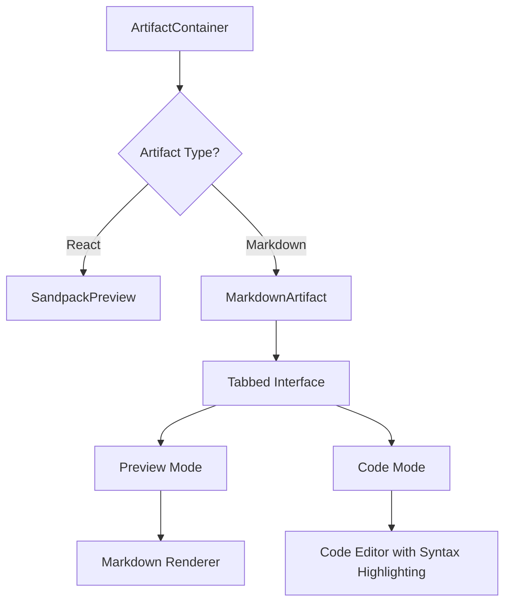

# Markdown Artifact System Implementation Plan

## 1. Overview

This document outlines the plan to implement a comprehensive markdown artifact system that seamlessly integrates with the existing React artifact support. The system will provide a dual-mode interface for markdown artifacts, allowing users to switch between a rendered HTML preview and a code editor with syntax highlighting.

## 2. Architecture

The new system will extend the existing artifact architecture by introducing a new artifact type for markdown. The `ArtifactPreview` component will be updated to conditionally render either the Sandpack preview for React artifacts or a new markdown component for markdown artifacts.

### Mermaid Diagram: Component Architecture

## 3. Component Design

### 3.1. `MarkdownArtifact` Component

A new `MarkdownArtifact` component will be created to handle the rendering of markdown artifacts. This component will feature a tabbed interface to switch between the preview and code modes.

*   **State Management**: The component will manage the active tab state (either `preview` or `code`).
*   **Preview Mode**: This mode will use a markdown rendering library (e.g., `react-markdown`) to display the markdown as HTML.
*   **Code Mode**: This mode will use a code editor component (e.g., `react-simple-code-editor` with `prism-react-renderer`) to display the markdown source with syntax highlighting.

### 3.2. `ArtifactPreview` Component Modification

The existing `ArtifactPreview` component will be modified to support the new markdown artifact type. It will check the artifact's type and render the `MarkdownArtifact` component if the type is `markdown`, otherwise it will render the `SandpackProvider` for React artifacts.

## 4. State Management

The existing Recoil state for artifacts (`artifactsState`) will be used to store the markdown content. No changes are required to the existing state management structure.

## 5. Dependencies

The following dependencies will be added to the project:

*   `react-markdown`: For rendering markdown content as HTML.
*   `remark-gfm`: A `react-markdown` plugin for GitHub Flavored Markdown support.
*   `react-simple-code-editor`: A lightweight code editor component.
*   `prism-react-renderer`: For syntax highlighting in the code editor.
*   `@radix-ui/react-tabs`: For creating the tabbed interface.

## 6. Implementation Phases

### Phase 1: Create the `MarkdownArtifact` Component

*   Create the basic structure of the `MarkdownArtifact` component.
*   Implement the tabbed interface using `@radix-ui/react-tabs`.
*   Integrate `react-markdown` for the preview mode.
*   Integrate `react-simple-code-editor` and `prism-react-renderer` for the code mode.

### Phase 2: Update `ArtifactPreview`

*   Modify the `ArtifactPreview` component to conditionally render the `MarkdownArtifact` component based on the artifact type.
*   Ensure that the existing React artifact functionality remains unchanged.

### Phase 3: Testing

*   Create unit tests for the `MarkdownArtifact` component.
*   Create integration tests to ensure that both React and markdown artifacts are rendered correctly.
*   Perform end-to-end testing to verify the complete functionality.

## 7. Potential Challenges

*   **Styling**: Ensuring that the rendered markdown has the correct styling and that the code editor's syntax highlighting is consistent with the application's theme.
*   **Performance**: The performance of the markdown rendering and syntax highlighting libraries will need to be evaluated to ensure that they do not negatively impact the application's performance.
