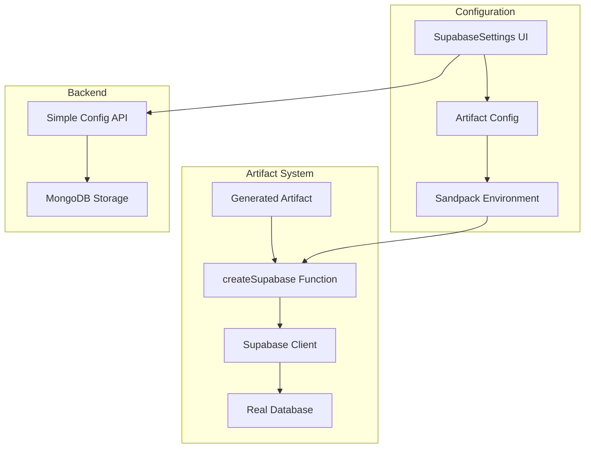

# Supabase Tools Refactor Plan

## Goal
Enable LibreChat artifacts to connect directly to Supabase databases for real data instead of mock data.

## Current Problems
1. **Duplicate Systems**: Artifact configs vs tool registry causing confusion
2. **Duplicate Schemas**: Multiple model definitions across packages
3. **Mock Implementations**: Non-functional connection testing and tool registry
4. **Over-Engineering**: Complex routes for simple configuration storage
5. **Missing Integration**: createSupabase() function not injected into Sandpack
6. **Dependency Issues**: Import problems causing Docker build failures

## Architecture Overview

## Refactoring Strategy

### Phase 1: Cleanup and Consolidation
1. **Remove Complex Tool Registry System**
   - Delete api/server/controllers/supabaseTools.js (1000+ lines of over-engineering)
   - Delete api/server/routes/supabaseTools.js 
   - Delete api/server/middleware/validators/supabaseTools.js
   - Remove packages/data-provider/src/tool-registry.ts
   - Remove packages/data-provider/src/supabase-platform.ts

2. **Consolidate Schema Definitions**
   - Keep only packages/data-schemas/src/schema/supabaseTool.ts (simplified)
   - Remove api/models/SupabaseTool.js (duplicate)
   - Update packages/data-schemas/src/models/supabaseTool.ts to use simplified schema

3. **Fix Dependency Issues**
   - Fix import paths in packages/data-schemas/src/models/index.ts
   - Ensure proper exports from @librechat/data-schemas

### Phase 2: Simplified Backend
1. **Create Simple Config Controller**
   - Basic CRUD operations for artifact Supabase configs
   - Real connection testing (not mocked)
   - User-scoped configuration storage

2. **Create Simple Routes**
   - GET /api/artifacts/:artifactId/supabase-config
   - POST/PUT /api/artifacts/:artifactId/supabase-config
   - POST /api/artifacts/:artifactId/supabase-config/test

3. **Implement Real Connection Testing**
   - Actual Supabase client connection testing
   - Proper error handling and validation

### Phase 3: Artifact Integration
1. **Create Supabase Helper for Sandpack**
   - Generate /lib/supabase.js file for each artifact
   - Inject user's Supabase config into the helper
   - Provide createSupabase() function

2. **Update Artifact Preview System**
   - Modify ArtifactPreview.tsx to inject Supabase helper
   - Pass config through Sandpack environment
   - Handle connection errors gracefully

3. **Update Shared Files System**
   - Add Supabase helper to sharedFiles in utils/artifacts
   - Ensure proper TypeScript support

### Phase 4: Frontend Polish
1. **Enhance SupabaseSettings Component**
   - Connect to simplified backend API
   - Implement real connection testing
   - Better error handling and UX

2. **Integration with Artifact System**
   - Ensure settings are saved per artifact
   - Handle configuration persistence
   - Add usage examples and documentation

## Implementation Tasks

### Backend Cleanup
- [ ] Remove over-engineered controller, routes, middleware
- [ ] Remove complex tool registry and platform abstractions
- [ ] Consolidate duplicate schema definitions
- [ ] Fix dependency import issues

### Simplified Backend
- [ ] Create simple artifact config controller
- [ ] Create basic CRUD routes for artifact configs
- [ ] Implement real Supabase connection testing
- [ ] Add proper validation and error handling

### Artifact Integration
- [ ] Create Supabase helper generator for Sandpack
- [ ] Update ArtifactPreview to inject helper files
- [ ] Modify shared files system for Supabase support
- [ ] Add TypeScript definitions for createSupabase()

### Frontend Integration
- [ ] Connect SupabaseSettings to simplified API
- [ ] Implement real connection testing in UI
- [ ] Add proper error handling and user feedback
- [ ] Update artifact configuration persistence

### Testing and Documentation
- [ ] Test artifact-to-database connectivity end-to-end
- [ ] Add usage examples and documentation
- [ ] Verify Docker build works correctly
- [ ] Add proper error handling for connection failures

## Success Criteria
1. ✅ Artifacts can import and use createSupabase() function
2. ✅ Real data is fetched from configured Supabase instances
3. ✅ Configuration UI works and persists settings
4. ✅ Connection testing actually validates Supabase connectivity
5. ✅ Docker builds work without dependency issues
6. ✅ Clean, maintainable codebase following LibreChat patterns